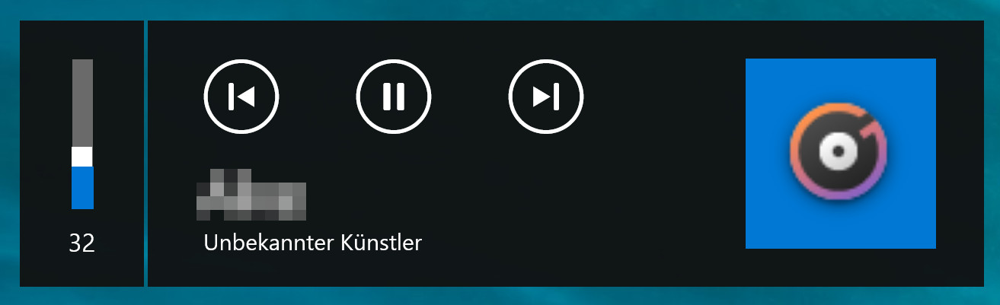

# System-Media-Transport-Control
Get information about your currently playing music and control it with your Browser!
## How it works
The application is providing a restfull api to get information about currently playing media on your Windows 10 Device.   
It uses the Windows 10 API (WinRT UWP) `GlobalSystemMediaTransportControlsSessionManager` class to get those information normaly seen when ajusting the computer volume (and much more!).   
You can use this api to get information about all currently registered media applications (Groove Music, Windows Video Player, Chrome, Spotify, etc) and control them.   
   


## Help

```cmd
== Web Help ==================
  http://localhost:8080/sessions/current
  http://localhost:8080/sessions/list

  http://localhost:8080/sessions/ctrl/current/play
  http://localhost:8080/sessions/ctrl/current/pause
  http://localhost:8080/sessions/ctrl/current/stop
  http://localhost:8080/sessions/ctrl/current/next
  http://localhost:8080/sessions/ctrl/current/previous

  http://localhost:8080/sessions/ctrl/{index}/play
  http://localhost:8080/sessions/ctrl/{index}/pause
  http://localhost:8080/sessions/ctrl/{index}/stop
  http://localhost:8080/sessions/ctrl/{index}/next
  http://localhost:8080/sessions/ctrl/{index}/previous
==============================

== Cmd Help ==================
  /ui          Shows UI
  /help        Shows this
==============================

== Settings Help =============
  Port         Server Port
  CanControl   Enables '/sessions/ctrl' endpoint
  ShowConsole  Wether the console should be visible during normal operation
==============================
```

## What you get
`http://localhost:8080/sessions/current`   
```json
{
   "Application":"Microsoft.ZuneMusic_8wekyb3d8bbwe!Microsoft.ZuneMusic",
   "IsCurrent":true,
   "Timeline":{
      "EndTime":"00:04:33.2140000",
      "LastUpdatedTime":"2020-11-09T17:32:28.5328531+01:00",
      "MaxSeekTime":"00:04:33.2140000",
      "MinSeekTime":"00:00:00",
      "Position":"00:00:00.0050000",
      "StartTime":"00:00:00"
   },
   "Media":{
      "AlbumArtist":"",
      "AlbumTitle":"Unbekanntes Album",
      "AlbumTrackCount":0,
      "Artist":"Unbekannter Künstler",
      "Genres":{
         
      },
      "PlaybackType":"music",
      "Subtitle":"",
      "Thumbnail":null,
      "Title":"Some Music",
      "TrackNumber":3
   },
   "Playback":{
      "AutoRepeatMode":"list",
      "Controls":{
         "IsChannelDownEnabled":false,
         "IsChannelUpEnabled":false,
         "IsFastForwardEnabled":false,
         "IsNextEnabled":true,
         "IsPauseEnabled":true,
         "IsPlayEnabled":false,
         "IsPlayPauseToggleEnabled":true,
         "IsPlaybackPositionEnabled":false,
         "IsPlaybackRateEnabled":false,
         "IsPreviousEnabled":true,
         "IsRecordEnabled":false,
         "IsRepeatEnabled":true,
         "IsRewindEnabled":false,
         "IsShuffleEnabled":true,
         "IsStopEnabled":false
      },
      "IsShuffleActive":false,
      "PlaybackRate":null,
      "PlaybackStatus":"playing",
      "PlaybackType":"music"
   }
}
```
